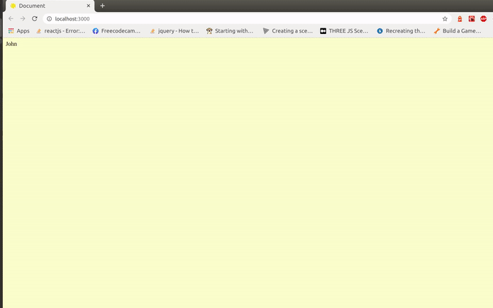
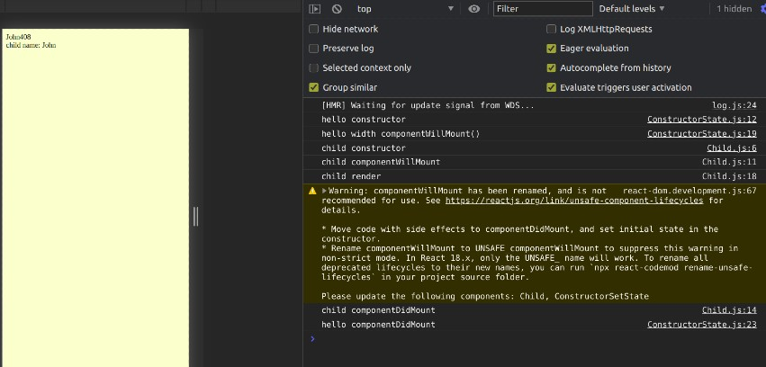
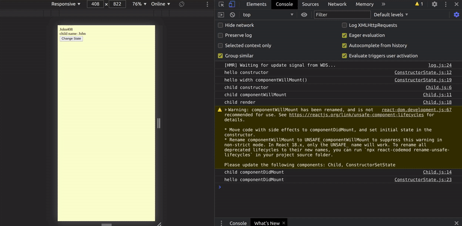
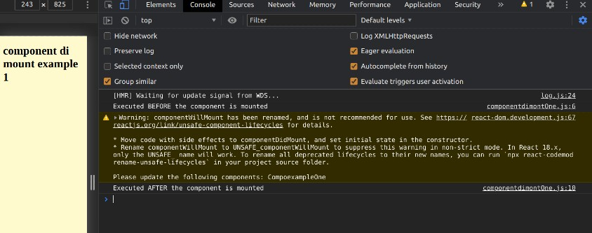

# RECAPITULATING REACT

#### UNDERSTANDING LIFE CYCLES

### 1 CONSTRUCTOR EXAMPLE 🚧

##### STATE , SETSTATE

- IN THE FOLLOWING EXAMPLE, we are going to determine which one runs FIRST

```javascript
class ConstructorSetState extends Component {
  // this runs BEFORE
  state = {
    name: "peter",
  };

  constructor() {
    super();
    // this runs AFTER
    this.state = {
      name: "John",
    };
    console.log("hello constructor");
  }

  render() {
    return (
      <div className="const_state">
        {/* you add it here so to be shown on the browser, not on the consoles */}
        {this.state.name}
      </div>
    );
  }
}

export default ConstructorSetState;
```

<br>
<br>

### 2 CONSTRUCTOR EXAMPLE 🚧

##### In this example we will be mixing the constructor and the componentWillMount

```javascript
class ConstructorSetState extends Component {
  state = {
    name: "peter",
  };

  constructor() {
    super();
    // this runs Before
    this.state = {
      name: "John",
    };
    console.log("hello constructor");
  }
  // ------
  // this runs AFTER
  componentWillMount() {
    console.log("hello Will Mount");
  }
  // ---------------
  render() {
    return (
      <div className="const_state">
        {/* you add it here so to be shown on the browser, not on the consoles */}
        {this.state.name}
      </div>
    );
  }
}

export default ConstructorSetState;
```

<br>

#### With the "componentWillMount" you can change the state, so SET STATE , BUT WHY WOULD YOU LIKE TO CHANGE THE STATE, why would you like to SETSTATE ? even after setting up the original state inside the constructor

##### the reason

- SOMETIMES BASED on the PROPS , you would like to change the state, and this would be an IDEAL way to do it because the COMPONENT has a MID RENDER, so if i change the state right now, the component are not going to RE-RENDER themselves, because it hasn render , because you go to the first initial state.

<br>

- ALSO componentWillMount onöy runs ONCE , AND THAT IS DURING THE INITAL RENDER.

- So what else can you do it ? so if you want to do soemthing with the GLOBAL EVENTS, LIKE a window or a DOCUMENT, YOU CAN SET IT HERE inside the componentWillMount.

##### In the following example, we will change the state of something, WE WILL SHOW THE WIDTH of the document when it will CHANGE the size of the window, for example like when we decrease the window while inspecting it.

```javascript
class ConstructorSetState extends Component {
  constructor() {
    super();
    // this runs Before
    this.state = {
      name: "John",
    };
    console.log("hello constructor");
  }
  // --------------
  //
  componentWillMount() {
    if (window.innerWidth < 500) {
      this.setState({ innerWidth: window.innerWidth });
    }
  }
  // ---------------
  render() {
    return (
      <div className="const_state">
        {/* you add it here so to be shown on the browser, not on the consoles */}
        {this.state.name}
        {this.state.innerWidth}
      </div>
    );
  }
}

export default ConstructorSetState;
```

<br>

- IF YOU NOTICE, the innerwidth is going to show only once, after that you wont see it, you will have to refresh the page to see it again.

<br>

[](s)

#### NOW LETS USE THE COMPONENTWILLMOUNT and the COMPONENTDIDMOUNT plus PROPS 🚧

- create a new file , so to see how the componentwill and did mount will work

- create the child.js

- copy everything from the App.js

- paste it inside the child.js

- import the child.js to the App.js

```javascript
// Child.js
import React, { Component } from "react";
import Child from "./Child";
//
//
class ConstructorSetState extends Component {
  constructor() {
    super();
    // this runs Before
    this.state = {
      name: "John",
    };
    console.log("hello constructor");
  }
  // ------
  // this runs AFTER
  componentWillMount() {
    if (window.innerWidth < 500) {
      this.setState({ innerWidth: window.innerWidth });
      console.log("hello width componentWillMount()");
    }
  }
  componentDidMount() {
    console.log("hello componentDidMount");
  }
  // ---------------
  render() {
    return (
      <div className="const_state">
        {/* you add it here so to be shown on the browser, not on the consoles */}
        {this.state.name}
        {this.state.innerWidth}
        <Child name={this.state.name} />
      </div>
    );
  }
}

export default ConstructorSetState;
//
//
// App.js
import React, { Component } from "react";
// import CompoexampleOne from "./components/componentdimontOne";
import ConstructorSetState from "./components/ConstructorState";

//
//
//

class App extends Component {
  render() {
    return (
      <React.Fragment>
        {/* <CompoexampleOne /> */}

        <ConstructorSetState />
      </React.Fragment>
    );
  }
}

export default App;
```

[]()

#### NOTICE that the component did mount of the "constructorstate.js" runned after the Child.js data and the child.js component did mount inself

- SO WITH THIS YOU HAVE A PREVIEW OF THE HIERARCHY

<br>
<br>

## NOW LETS TEST IT ON A BUTTON

#### HERE we are going to add a button that when the user will click, it will change the "name" from John to Jill but since the this. is connected now to the Child.js the "name" also will change there...

- START BY ADDING THE FOLLOWING TO THE HTML

```javascript
// ConstructorState.js
<button onClick={this.changeState}>Change State</button>
```

- THEN CREATE THE EVENT THAT WILL BE CONNECTED TO THE BUTTON

```javascript
// ConstructorState.js
  changeState() {
    this.setState({ name: "jill" });
  }
```

# Bind

- NOW WE WILL NEED TO BIND or connect this click event button to the all the files that have the this. and the name

```javascript
// ConstructorState.js
<button onClick={this.changeState.bind(this)}>Change State</button>
```

### SO if I understand the "this." carry the information across the files

- THE CODE

```javascript
// ConstructorState.js
//
class ConstructorSetState extends Component {
  constructor() {
    super();
    // this runs Before
    this.state = {
      name: "John",
    };
    console.log("hello constructor");
  }
  // ------
  // this runs AFTER
  componentWillMount() {
    if (window.innerWidth < 500) {
      this.setState({ innerWidth: window.innerWidth });
      console.log("hello width componentWillMount()");
    }
  }
  componentDidMount() {
    console.log("hello componentDidMount");
  }
  // ---------------

  changeState() {
    this.setState({ name: "jill" });
  }

  /*
  
  
  
  */
  render() {
    return (
      <div className="const_state">
        {/* you add it here so to be shown on the browser, not on the consoles */}
        {this.state.name}
        {this.state.innerWidth}
        <Child name={this.state.name} />
        <button onClick={this.changeState.bind(this)}>Change State</button>
      </div>
    );
  }
}

export default ConstructorSetState;
```

[]()

<br>
<br>
<hr>
<br>
<br>

## From another tutorial 🌻

### 3 COMPONENT WILL MOUNT AND COMPONENT DID MOUNT 🚧

<br>

- IN THE FOLLOWING EXAMPLE YOU CAN SEE THE LOGIC on it

```javascript
import React, { Component } from "react";
// dont forget this damn thing

class CompoexampleOne extends Component {
  componentWillMount() {
    console.log("Executed BEFORE the component is mounted");
  }

  componentDidMount() {
    console.log("Executed AFTER the component is mounted");
  }

  //
  //
  //
  //
  render() {
    return <h1>component di mount example 1</h1>;
  }
}

export default CompoexampleOne;
```

#### IF YOU NOTICE

- The componentWillMount() will be executed BEFORE

<br>

[]()

### the video

> https://www.youtube.com/watch?v=kVyrzn29QPk

- last seen : 13:42